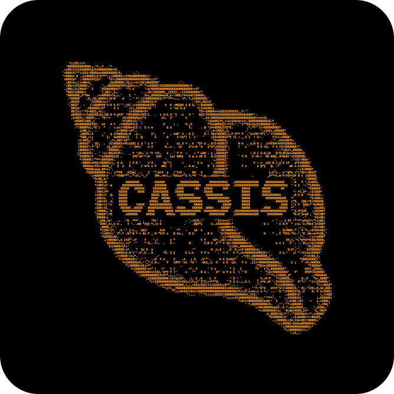

<p align="center">
  
</p>

<p align="center">
  <strong>MCP server plugin for Grasshopper (Rhino 8)</strong><br>
  A Grasshopper plugin that lets agentic LLMs interact with Grasshopper.
</p>

<p align="center">
  <a href="https://github.com/UniStuttgart-ICD/cassis/releases/latest">Download latest release</a> &middot;
  <a href="#installation">Installation</a> &middot;
  <a href="#usage">Usage</a> &middot;
  <a href="CONTRIBUTING.md">Contributing</a>
</p>

---

## What is Cassis?

Cassis is a bridge between AI coding assistants and Grasshopper. It uses the [Model Context Protocol (MCP)](https://modelcontextprotocol.io/docs/getting-started/intro) — an open standard that lets AI tools talk to external software.

Setup has two sides:

1. **Grasshopper side** — Install the Cassis plugin, which runs an MCP server inside Grasshopper
2. **AI tool side** — Point your AI assistant (VS Code Copilot, Cursor, Claude Code, etc.) at that server

Once both sides are connected, your AI assistant can read, create, and modify Grasshopper definitions directly.

## Installation

The current release supports Rhino 8 on Windows.

### From release (recommended)

1. Download `Cassis.zip` from the [latest release](https://github.com/UniStuttgart-ICD/cassis/releases/latest)
2. If you are updating, move the existing `%APPDATA%\Grasshopper\Libraries\Cassis\` folder out of `Libraries`
3. Extract the new `Cassis` folder to `%APPDATA%\Grasshopper\Libraries\`
4. Restart Rhino

The release zip includes `Cassis.gha`, the DLL files the plugin needs, the project license, and third-party notices.

### From source

```bash
git clone https://github.com/UniStuttgart-ICD/cassis.git
cd cassis
dotnet build -f net8.0-windows src/GrasshopperMCP/GrasshopperMCP.csproj
```

The build deploys `Cassis.gha` to `%APPDATA%\Grasshopper\Libraries\Cassis\` automatically.

## Usage

1. Open Grasshopper and place the **Cassis** component on the canvas
2. The MCP server starts at `http://localhost:3003/mcp/`

Cassis accepts connections only from the local machine and has no application-level authentication. Use it only on a trusted Windows machine and session.
3. Connect your AI client (Claude, etc.) to that URL

Right-click the component to choose which tools are exposed. A practical default set is enabled on startup.

### MCP Client Config

Configure Cassis as an HTTP MCP server. For example, in VS Code:

```json
{
  "servers": {
    "cassis": {
      "type": "http",
      "url": "http://localhost:3003/mcp/"
    }
  }
}
```

Config formats vary by client. See the [MCP configuration guide](skills/cassis-setup/references/mcp-config-guide.md) for other tools.

## Agent Setup

You can let your AI coding assistant handle the setup. Copy this prompt into your AI tool:

> Read and follow the installation skill at `skills/cassis-setup/SKILL.md`

The skill is auto-discoverable from these standard paths:
- `.github/skills/cassis-setup/` (VS Code Copilot)
- `.claude/skills/cassis-setup/` (Claude Code)
- `.agents/skills/cassis-setup/` (Agent Skills standard)

Or use the [MCP configuration guide](skills/cassis-setup/references/mcp-config-guide.md) for framework-specific config locations.

## Tools

Tools are organized by category. Default-enabled tools marked with **(D)**.

| Category | Examples |
|----------|----------|
| **Components** | `addcomponent` **(D)**, `getdetailedcomponentinfo`, `set_component_value` |
| **Scripts** | `list_csharp_scripts` **(D)**, `edit_csharp_script` **(D)**, `add_script_parameter` |
| **Connections** | `getallconnections` **(D)**, `connect_components_by_name`, `validateconnection` |
| **Panels** | `list_panels` **(D)**, `get_panel_text` **(D)**, `set_panel_text` **(D)** |
| **Document** | `loaddocument` **(D)**, `closedocument` **(D)**, `getdocumentinfo` **(D)** |
| **Canvas and viewport** | `canvas_snapshot` **(D)**, `capture_viewport` **(D)**, `manage_namedviews` **(D)** |
| **Solver** | `getsolutionstate` **(D)**, `forcedocumentsolution`, `toggle_solverexecute` |
| **Diagnostics** | `getsystemhealth`, `runhealthcheck`, `listhealthchecks` |

Prompts are also available for creating, analyzing, and troubleshooting Grasshopper definitions.

## Development

### Project Structure

```
src/
├── GrasshopperMCP/                       # Plugin assembly (Cassis.gha)
│   ├── Tools/                            # MCP tool implementations
│   ├── Services/                         # Grasshopper service interfaces + impls
│   ├── MCP_grasshopper_native/           # Tool selection and registry
│   └── UI/                               # Grasshopper component UI
└── ModelContextProtocol.HttpListener/    # HTTP/SSE transport
tests/
├── GrasshopperMCP.Tests/                 # NUnit tests
└── grasshopper_mcp_tester.py             # Python integration tests
```

### Commands

```bash
dotnet restore GrasshopperMCP.sln
dotnet build GrasshopperMCP.sln -c Release --no-restore --no-incremental
dotnet test tests/ModelContextProtocol.HttpListener.Tests/ModelContextProtocol.HttpListener.Tests.csproj -c Release --no-build
pwsh ./scripts/New-ReleasePackage.ps1 -NoBuild
```

### Adding a Tool

1. Create a class in `Tools/` with `[McpServerToolType]`
2. Add methods with `[McpServerTool]`
3. Register in `MCP_grasshopper_native/ToolRegistry.cs`

```csharp
[McpServerToolType]
public static class MyTools
{
    [McpServerTool, Description("Does something")]
    public static async Task<CallToolResult> MyTool(
        [Description("Input param")] string input)
    {
        return await McpExtensions.SafeExecuteAsync(async () =>
        {
            var doc = Instances.ActiveCanvas?.Document;
            return new { success = true };
        }, nameof(MyTool));
    }
}
```

## Troubleshooting

| Problem | Fix |
|---------|-----|
| Plugin not loading | Check that `%APPDATA%\Grasshopper\Libraries\Cassis\` exists and contains `Cassis.gha` plus the DLL files from `Cassis.zip`. Do not copy only the `.gha` file. Restart Rhino after copying the folder. |
| MCP server not starting | Check port 3003 isn't in use |
| Component creation fails | Ensure Grasshopper has an active document |
| Script errors | Use `get_csharp_script_errors` / `get_python_script_errors` |

## Contributing

See [CONTRIBUTING.md](CONTRIBUTING.md) for setup and guidelines.

## License

[MIT](LICENSE)
